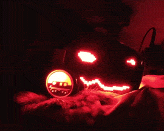

# Toaster Blaster

This is a LED control program for protogen helmets to be used with MAX7219 LED matrixes and ESP32 dev boards. 

*Note that this is a pre-release with some bugs, unfinished code and a major lack of documentation.* 
*Use at your own risk.*  

# Setup
*For now I can provide a brief setup guide as I don't have time to write detailed documentation. Sorry!*  

## Hardware

The following hardware is supported, with more to come in the future:
- ESP32-WROOM dev board
- MAX7219 LED Dot matrix modules (Two 32x8 (FC16) modules for mouth, one 32x8 cut in half for eyes and two 8x8 modules for nose)
- SSD1306 128x64 OLED I2C display (Heads up display)
- MOCUTE 052 Bluetooth Gamepad
- TCRT5000 Infrared obstacle avoidance sensor (Boop sensor, analog and digital)
- WS2812 LED strip or something similar supported by the FastLED library
- Any 5V PWM controlled fan (Noctua NF-A4x20 5V PWM)

Optional MAX4466 amplified microphone module can be used for mouth animation and spectrum analyzer. I've had the MAX7219 display drivers cause a lot of unwanted interference, so it's best to not use the microphone for now.

Most if not all hardware can be purchased on sites like aliexpress or ebay.   

## Wiring

### MAX7219 LED Dot matrix
MAX7219 can be daisy chained. Wire up displays in this order: 

- ESP32
1. Eye Left (16x8)
2. Mouth Left (32x8)
3. Nose Left (8x8)
4. Nose Right (8x8)
5. Mouth Right (32x8)
6. Eye Right (16x8)

 

| MAX7219 | ESP32 |
| - | - |
| DIN | 23 |
| CS | 5 |
| CLK | 18 |

**Use an external 5V power supply!** Powering the matrixes from the 5V pin on your ESP32 board is not recommended. Also avoid using dupont cables and solder directly instead.  

### SSD1306 heads up display
| SSD1306 | ESP32 |
| - | - |
| SCL | 22 |
| SDA | 21 |

Both 3.3V or 5V should work for power  

### TCRT5000 infrared sensor
**For better tracking and easier calibration use the analog output.**
| TCRT5000 | ESP32 |
| - | - |
| A0 | 39 (SN) for analog |
| D0 | 19 for digital |

Use 3.3V for power  

### WS2812 LED strip
| WS2812 | ESP32 |
| - | - |
| DIN | 15 |

Use an **external** 5V power supply  

### Fan PWM Control
| Fan header | ESP32 |
| - | - |
| PWM (Blue) | 16 |

Use an **external** 5V power supply  

## Software setup
- You'll need [Visual Studio code](https://code.visualstudio.com) with the PlafromIO IDE extension installed. 
- Clone this project and add it in the PlatformIO menu (**PlatformIO -> PIO Home -> Projects & Configuration -> Add Existing**). This should set up a development environment and download all necessary dependencies.
- Press **PlatformIO: Build (Ctrl+Alt+B)** to build your project.
- When ready, connect your ESP32 board and press **PlatformIO: Upload (Ctrl+Alt+U)**. Wait until *Connecting...* message shows up and hold down the **BOOT** button on your ESP32 until it starts uploading.
- Turn on your gamepad and flip **KEY/GAME** switch to **GAME** position.
- Enjoy!

*todo: Settings like matrix brightness or boop sensor sensitivity currently don't have a way to restore default values, therefore you'll need to adjust them to your liking.*  

## Default controller mapping
The default button mapping in "GAME" mode is as follows:
| Buttons | Action |
| - | - |
| BACK, MENU, X | Change face set (FaceSwitcherController) |
| Joystick movement | Current controller action (Change face, navigate menu) |
| Trigger | Blink eye |
| Y | Run automatic face switcher (AutomaticFaceSwitcherController) |
| B | Show Stats/Settings (SettingsController) |
| A | Calibrate analog boop sensor |

In "KEY" mode, both joystick and ABXY buttons trigger controller actions.

 

## (todo) Quick configuration
- Important configuration constants can be found in [config.h](src/config.h)
- `setup()` function in [main.cpp](src/main.cpp) handles registering and initializing displays, peripherals, used transitions and overlays
- Change button mapping in the `createButtonMapping()` function
- Change settings menu in the `createSettingsMenu()` function
- Debug messages DDEBUG, DBTDEBUG and DMICDEBUG can be enabled in [platformio.ini](platformio.ini)
  

## (todo) Display configuration
  

## (todo) Custom animations
- Check [Bitmaps.h](src/Animation/Bitmaps.h), [Bitmaps.cpp](src/Animation/Bitmaps.cpp) for bitmap definitions
- [Sequences.h](src/Animation/Sequence/Sequences.h), [Sequences.cpp](src/Animation/Sequence/Sequences.cpp) store animation sequences. Read the included [README](src/Animation/Sequence/README.txt) file.
- [Transitions.h](src/Animation/Overlay/Transitions.h), [Transitions.cpp](src/Animation/Overlay/Transitions.cpp), [Overlays.h](src/Animation/Overlay/Overlays.h), [Overlays.cpp](src/Animation/Overlay/Overlays.cpp) for overlay sequences and transitions.
  

# (todo) Contributing
  

# License
This program is licensed under [GNU Affero General Public License v3.0](LICENSE).