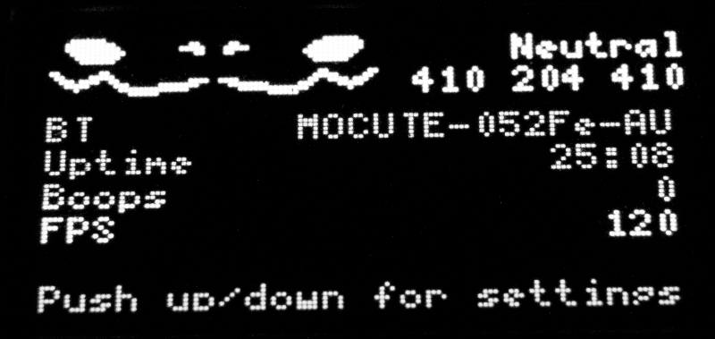
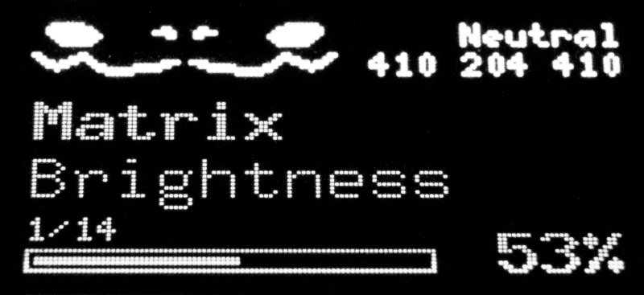
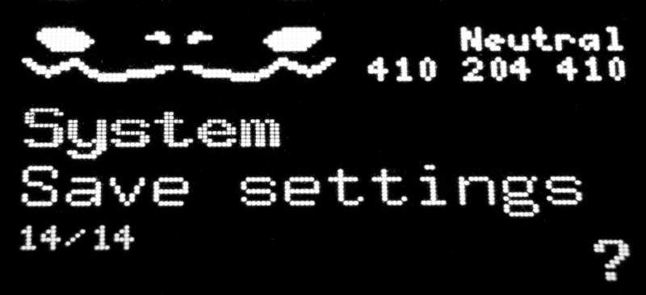
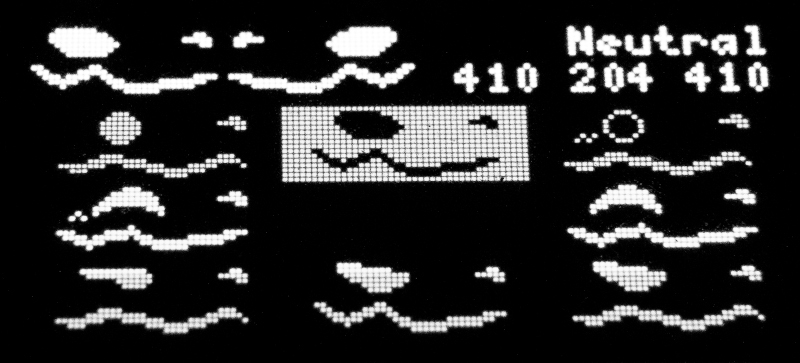
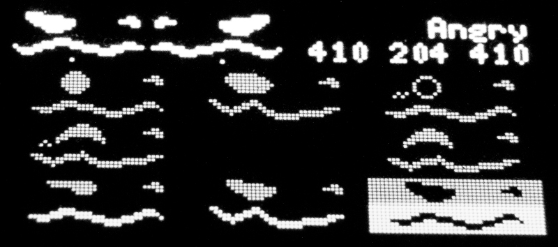
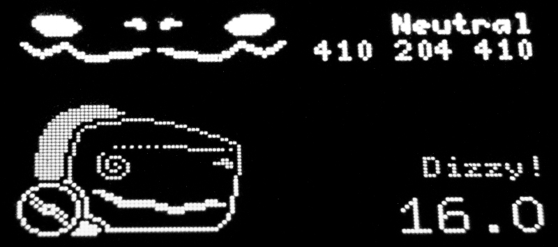

 
    

    
    
    

 
This is an LED control program for protogen helmets to be used with MAX7219 LED matrixes and ESP32 dev boards. 
Note that this is a pre-release with some bugs, unfinished code and a major lack of documentation. 
Use at your own risk.

# Setup
*For now I can provide a brief setup guide as I don't have time to write detailed documentation. Sorry!*  

## Hardware

The following hardware is supported, with more to come in the future:
- ESP32-WROOM dev board
- MAX7219 LED Dot matrix modules (Two 32x8 (FC16) modules for mouth, one 32x8 cut in half for eyes and two 8x8 modules for nose)
- SSD1306 128x64 OLED I2C display (Heads up display)
- MOCUTE 052f Bluetooth Gamepad or Xbox Wireless Gamepad (Xbox One, Xbox Series)
- TCRT5000 Infrared obstacle avoidance sensor (Boop sensor, analog and digital)
- WS2812 LED strip or something similar supported by the FastLED library (LED strips on left and right sides)
- MAX9814 Electret microphone module (For animated mouth)
- Any 5V PWM controlled fan (Noctua NF-A4x20 5V PWM) (A fan is a must for proper airflow)

A minimum viable setup requires a dev board, bluetooth gamepad and SSD1306 heads up display. Alternatively you can test using the wokwi simulator. 
Most if not all hardware can be purchased on sites like aliexpress or ebay.   

## Wiring

### MAX7219 LED Dot matrix
MAX7219 can be daisy chained. Wire up displays in this order: 

- ESP32
1. Eye Left (16x8)
2. Mouth Left (32x8)
3. Nose Left (8x8)
4. Nose Right (8x8)
5. Mouth Right (32x8)
6. Eye Right (16x8)

 

| MAX7219 | ESP32 |
| - | - |
| DIN | 23 |
| CS | 5 |
| CLK | 18 |

**Use an external 5V power supply!** Powering the matrixes from the 5V pin on your ESP32 board is not recommended. Also avoid using dupont cables and solder directly instead.  

### SSD1306 heads up display
| SSD1306 | ESP32 |
| - | - |
| SCL | 22 |
| SDA | 21 |

Both 3.3V or 5V should work for power  

### TCRT5000 infrared sensor
**For better tracking and easier calibration use the analog output.**
| TCRT5000 | ESP32 |
| - | - |
| A0 | 39 (marked SN or VN) for analog |
| D0 | 19 for digital |

Use 3.3V for power  

### WS2812 LED strip
| WS2812 | ESP32 |
| - | - |
| DIN | 15 |

Use an **external** 5V power supply  

### MAX9814 Electret microphone module
| MAX9814 | ESP32 |
| - | - |
| DIN | 36 (marked VP) |

Connect VDD to 3.3V 
Connect AR to GND for a 1:500 attack/release ratio 
Connect GAIN to VDD for a 40dB gain 

### Fan PWM Control
| Fan header | ESP32 |
| - | - |
| PWM (Blue) | 16 |

Use an **external** 5V power supply  

## Software setup
- You'll need [Visual Studio code](https://code.visualstudio.com) with the PlafromIO IDE extension installed. 
- Clone this project and add it in the PlatformIO menu (**PlatformIO -> PIO Home -> Projects & Configuration -> Add Existing**). This should set up a development environment and download all necessary dependencies.
- Connect your ESP32 board and erase flash by navigating to PlatformIO menu -> Project tasks -> esp32dev -> Platform -> **Erase Flash**.
- Press **PlatformIO: Build (Ctrl+Alt+B)** to build your project.
- Press **PlatformIO: Upload (Ctrl+Alt+U)**. Wait until *Connecting...* message shows up and hold down the **BOOT** button on your ESP32 until it starts uploading.
- Your microcontroller is now ready to use.

## Bluetooth gamepad setup
- [config.h](src/config.h) contains configuration constants including gamepad selection.
- Uncomment your gamepad of choice. Only one type of gamepad can be enabled at a time. After making changes, reupload to your microcontroller.
- To connect MOCUTE 052f gamepad, hold B and power button. The gamepad should turn on with a flashing LED. Flip the KEY/GAME switch to GAME position. Power up your microcontroller and check the heads up display, the gamepad name being displayed next to BT means the gamepad is connected successfully.
- To connect Xbox Wireless gamepad, turn it on by holding down the xbox button until it starts blinking. Enable pairing mode by the holding sync button for two seconds. The blinking should now be faster. Power up your microcontroller and check the heads up display, the gamepad name being displayed next to BT means the gamepad is connected successfully.
- If you face connection issues, try erasing flash as described in software setup.

## Gamepad button mapping
| Action | Button (Xbox) | Button (MOCUTE 052f, GAME mode) |
| - | - | - |
| Controller action | Left joystick, Right joystick, Directional pad | Joystick |
| Face switcher | X, Y, B | Back (Select), X, Menu (Start) |
| Show Settings | A | B |
| Automatic face switcher | Menu (Start) | Y |
| Blink eye (hold) | RB | Trigger (OK) |
| Calibrate boop sensor | View (Select) | A |

- This configuration is meant to be used with right hand only. Read [gamepad-button-mapping.md](docs/gamepad-button-mapping.md) for information about remapping buttons.

## Controls
### Settings (Controller_Settings)
The default screen displays brief information. Press up or down on the joystick to navigate through settings.

    

When a setting is displayed, move the joystick left or right to change the value. Settings must be saved manually (System - Save Settings).

    
    

### Face switcher (Controller_FaceSwitcher)
Selectable faces are displayed in a grid of 8. Moving the joystick selects a face pointing in that direction. Releasing the joystick transitions to the selected face. The name of the currently selected face is displayed in the top right corner.

    
    
    

### Automatic face switcher (Controller_AutomaticFaceSwitcher)
Automatically transitions to displayed face after the timer runs out. This process runs indefinitely. Move joystick in any direction to skip the timer. Skip the face by pressing the automatic face switcher button.

    

## Editing face bitmaps:
- Check the [Bitmaps directory](src/Assets/Bitmaps) containing images for eyes, mouth and nose. 
- Images are converted from png to source code during the build process. Simply edit the images and rebuild (Ctrl+Alt+B).

## Testing without hardware
- Included are diagram.json and wokwi.toml files for testing using the [Wokwi Simulator](https://marketplace.visualstudio.com/items?itemName=wokwi.wokwi-vscode) plugin for VS Code.
- Install the plugin according to the [Wokwi documentation](https://docs.wokwi.com/vscode/getting-started#installation).
- Build the program first with PlatformIO **(Ctrl+Alt+B)**. Then, press **F1** and select **Wokwi: Start Simulator**
- If nothing happens for a while, try disabling the gamepad in config.h and try again.
- Note that the simulation is going to be considerably slower than hardware. I only recommend using this approach for quickly testing new ideas without hardware.

## (todo) Quick configuration
- Important configuration constants can be found in [config.h](src/config.h)
- `setup()` function in [main.cpp](src/main.cpp) handles registering and initializing displays, peripherals, used transitions and overlays
- Change button mapping in the `createButtonMapping()` function
- Change settings menu in the `createSettingsMenu()` function
- Debug messages DDEBUG, DBTDEBUG and DMICDEBUG can be enabled in [platformio.ini](platformio.ini)
  

## (todo) Display configuration
  

## (todo) Custom animations
- [Sequences.h](src/Assets/Sequences/Standard.h), [Sequences.cpp](src/Assets/Sequences/Standard.cpp) store animation sequences. Read the included [README](src/Assets/Sequences/README.txt) file.
- [Transitions.h](src/Assets/Transitions/Standard.h), [Transitions.cpp](src/Assets/Transitions/Standard.cpp), [Overlays.h](src/Assets/Overlays/Standard.h), [Overlays.cpp](src/Assets/Overlays/Standard.cpp) for overlay sequences and transitions.
  

# (todo) Contributing
  

# Credits
- [olikraus/u8g2](https://github.com/olikraus/u8g2)
- [FastLED/FastLED](https://github.com/FastLED/FastLED)
- [kosme/arduinoFFT](https://github.com/kosme/arduinoFFT)
- [MikeLankamp/fpm](https://github.com/MikeLankamp/fpm)
- [h2zero/NimBLE-Arduino](https://github.com/h2zero/NimBLE-Arduino)

# License
This program is licensed under [GNU Affero General Public License v3.0](LICENSE).